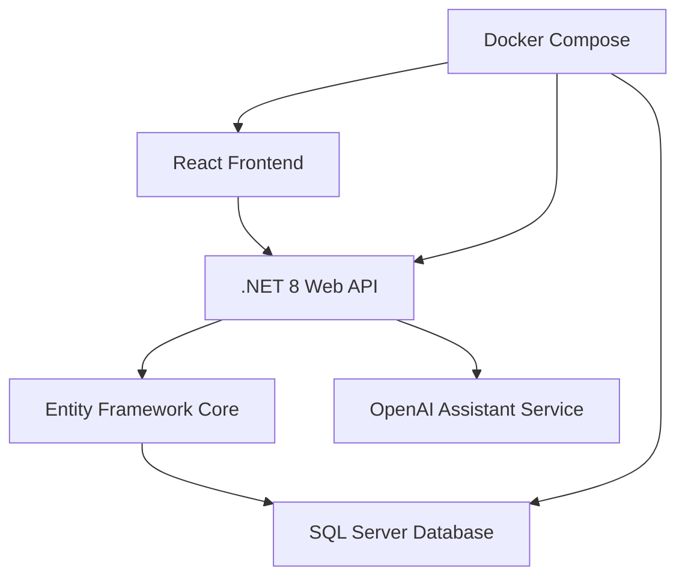

# AIPharm+

AIPharm+ is a full digital-pharmacy demo that combines a .NET 8 Web API, a React + TypeScript storefront, seeded SQL Server
data, and an AI chat assistant powered by OpenAI. The goal is to help you explore a realistic e-commerce experience that includes
medical product browsing, ordering, and conversational support.

> **Current version:** 0.1.0 (January 2025)

### 0.1.0 release notes
- Version banner added to the storefront footer so visitors always know which release is running.
- Documentation refreshed with AI agent guidance and up-to-date setup instructions.
- Verified that no client-side caching layer is active yet—see the new performance notes if you plan to add one.

This README keeps the original project context while adding step-by-step setup guidance for newcomers. If you follow each section
in order you will have the project running locally.

---

## Project overview

### Key highlights
- **AI medical assistant** – ask medication questions and receive context-aware answers from the OpenAI API.
- **Modern storefront** – a responsive React UI with search, categories, cart management, and localized Bulgarian/English text.
- **Production-style backend** – .NET 8 Web API with JWT authentication, Swagger docs, health checks, and Entity Framework Core.
- **Ready-to-use data** – seeded products, categories, customers, and orders so you can test flows immediately.

### Feature tour

| Frontend | Backend |
| --- | --- |
| React 18 + TypeScript + Vite | .NET 8 Web API with Clean Architecture |
| Tailwind CSS styling with responsive layouts | Entity Framework Core with SQL Server |
| Dynamic product catalog, cart, and checkout flows | JWT authentication, email notifications, and background services |
| Built-in AI chat widget for customer help | Swagger/OpenAPI docs, health checks, and seeded demo data |

### Performance and caching
- **Client-side caching:** Not yet implemented. Product and news data are fetched directly from the API on each visit, so consider integrating React Query, SWR, or a service worker cache for frequently accessed resources.
- **Build-time optimization:** The Vite build already code-splits the React bundle. Host the compiled assets behind a CDN to take advantage of HTTP caching headers.
- **Backend caching:** The .NET API queries SQL Server per request. Introduce Redis or in-memory caching for high-traffic endpoints when you move beyond demo scale.

### Architecture at a glance


### Example API responses
<details>
<summary>Product response</summary>

```json
{
  "id": 1,
  "name": "Парацетамол 500мг",
  "nameEn": "Paracetamol 500mg",
  "description": "Ефективно обезболяващо и жаропонижаващо средство",
  "price": 2.30,
  "stockQuantity": 150,
  "categoryName": "Обезболяващи",
  "requiresPrescription": false
}
```

</details>

<details>
<summary>AI assistant prompt and reply</summary>

```json
{
  "question": "What is the recommended dosage for ibuprofen?",
  "answer": "Adults can take 200–400 mg every 4–6 hours. Do not exceed 1200 mg in 24 hours without medical supervision."
}
```

</details>

## AI agents & automation (AI агенти)
- Learn how the AI chat assistant is wired into the backend, how it stores context, and how to extend it for customer-service automations in [`docs/AI-AGENTS.md`](docs/AI-AGENTS.md).
- Документът включва **начални промптове** за стартиране на агент за разработка, примерни правила за безопасност и инструкции за наблюдение на разходите към OpenAI API.
- Recommended starter prompt for development work: _"Act as the AIPharm+ development co-pilot. Before coding, confirm the active feature flag set, check the current version (0.1.0), and list impacted microservices. Provide a step-by-step plan before editing files."_  
  Препоръчителен начален промпт (BG): _"Действай като AIPharm+ агент за разработка. Провери текущата версия (0.1.0), активните функционални флагове и зависимостите към бекенда, след което предложи план на български преди да правиш промени."_

Use the sections below when you are ready to clone the repository and configure your environment.

---

## 1. What you need before cloning the project

| Purpose | What to do |
| --- | --- |
| Source code | Install [Git](https://git-scm.com/downloads). You will use it to copy the project from GitHub. |
| Running everything with one command | Install [Docker Desktop](https://www.docker.com/products/docker-desktop/). It lets you run the backend, database, and frontend without configuring them one by one. |
| AI chat assistant | Create an [OpenAI account](https://platform.openai.com/). The chat bot uses the paid API, so add a billing method and buy some credits before you run the project. Afterwards create an API key and keep it private. |
| Outgoing email (optional) | The sample configuration uses Gmail. If you want email to work you must use **your own mailbox** and app password. Do **not** ship the default password. |
| Manual development (optional) | If you prefer running the projects yourself install the .NET 8 SDK, Node.js 18+, and a SQL Server instance. These are not required when using Docker. |

> **Tip:** Set up the OpenAI account and email credentials first. You will need them when editing the configuration files in step 3.

---

## 2. Copy the project from GitHub

Open a terminal (PowerShell on Windows, Terminal on macOS/Linux) and run:

```bash
git clone https://github.com/your-username/AIPharm.git
cd AIPharm
```

You should now be inside the project folder that contains the `docker-compose.yml` file.

---

## 3. Update the secrets and passwords

All secrets live in text files so you must edit them once before starting the project.

### 3.1 Choose a database password
1. Open `docker-compose.yml` in a text editor.
2. Replace every instance of `Xyzzy2005!` with **your own strong password**. There are two lines to change (one under `database`, one under `backend`).
3. Save the file.

### 3.2 Add your OpenAI API key
There are two easy options—pick whichever you prefer:

- **Option A: environment variable (recommended for Docker users)**  
  1. Create a new file named `.env` in the project root.  
  2. Paste the line `OpenAI__ApiKey=your-openai-api-key` and save.  
  3. Docker Compose automatically loads the value and passes it to the backend.

- **Option B: edit the appsettings file**  
  1. Open `AIPharm.Backend/AIPharm.Web/appsettings.json`.  
  2. Find the `"OpenAI": { "ApiKey": "" }` section and paste your key between the quotes.  
  3. Save the file.  
  4. Remember not to commit this file to public source control.

### 3.3 Configure email (optional)
If you want the app to send verification emails:
1. Open `AIPharm.Backend/AIPharm.Web/appsettings.json`.
2. In the `Email` section replace the Gmail address, app password, and other settings with your own email provider values.  Gmail requires 2-Step Verification and an app password.
3. To store copies of outgoing emails on disk set `UsePickupDirectory` to `true` and pick a folder inside `AIPharm.Backend/AIPharm.Web/App_Data`.

If you do not need email right now you can leave the defaults. The app will still run.

---

## 4. Start everything with Docker (recommended)

1. Make sure Docker Desktop is running.
2. From the project root run:
   ```bash
   docker-compose up --build
   ```
3. The first run downloads several images and may take a few minutes.  When the logs quiet down you are ready.

### Where to go next
- Frontend store: http://localhost:3000
- Backend API: http://localhost:5000/swagger
- SQL Server: localhost on port 1433 (use the password you chose earlier)

To stop everything press `Ctrl + C` in the terminal.  To delete the containers run `docker-compose down`.

---

## 5. Log in with the sample accounts

| Role | Email | Password |
| --- | --- | --- |
| Administrator | aipharmproject@gmail.com | Admin123! |
| Staff | diyana.angelova@example.com | Employee123! |
| Staff | petar.iliev@example.com | Employee456! |
| Customer | maria.ivanova@example.com | Customer123! |
| Customer | georgi.petrov@example.com | Customer456! |

Change the admin password after your first login if you will use this project for a demo.

---

## 6. Optional: run the projects without Docker

If you installed the optional tooling from the prerequisites you can run each project by hand:

### Backend (.NET)
```bash
cd AIPharm.Backend
dotnet restore
cd AIPharm.Web
dotnet ef database update
dotnet run
```
This starts the API on https://localhost:7001 by default.

### Frontend (React)
```bash
cd src
npm install
npm run dev
```
Open the site at http://localhost:5173.  If the backend runs on a different port update `VITE_API_BASE_URL` in `src/.env` or start the dev server with `VITE_API_BASE_URL=https://localhost:7001/api npm run dev`.

### Database
Attach to your SQL Server using the password you set in section 3.1.

---

## 7. Common questions

- **Do I have to pay OpenAI?** Yes. The chat assistant calls the paid API. Without credit on your OpenAI account the requests will fail with a 401/403 error.
- **The backend cannot connect to SQL Server.** Double-check that the password you put into `docker-compose.yml` matches the one in the connection string.  Restart the containers after changing it.
- **Emails are not arriving.** Verify the address, password, and SMTP host in `appsettings.json`. Gmail requires an app password and TLS on port 587.
- **How do I reset everything?** Run `docker-compose down -v` to delete the containers and database volume, then start again with `docker-compose up --build`.

---

You now have a local copy of AIPharm+.  Explore the code, change the styling, or extend the API once you are comfortable.
